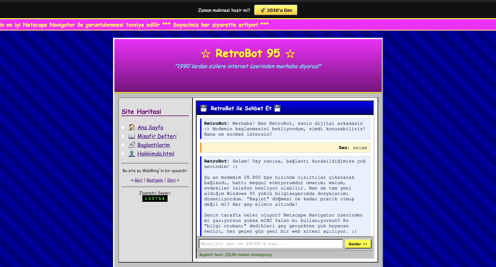
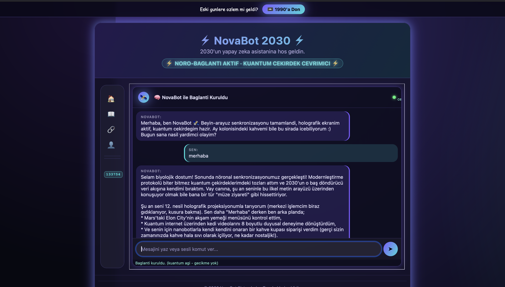

# RetroBot 95 — A Chatbot Stuck in the 1990s (that can also jump to 2030)

A chatbot that thinks it's still living in the 1990s. Python + FastAPI
backend, talking to Google Gemini's Interactions API; a plain HTML/CSS/JS
frontend styled like a website from that era. A "Modernize" button at the
top switches both the bot's persona and the UI into a 2030 version (VR /
holographic-inspired design).

## Features

- **Two personas:** the default "RetroBot" (1990s, has no idea what
  happened after 2000) and "NovaBot" (2030, unlocked via the "Modernize"
  button — neuro-implants, holograms, flying taxis, and other over-the-top
  future tech).
- **Two themes:** retro (marquee, "under construction" badge, table
  layout) and future (glassy/holographic panels, icon-rail navigation,
  neon glow effects).
- Conversation continuity with Gemini is handled server-side via
  `previous_interaction_id`.

## Screenshots

| Retro mode (1990s) | Future mode (2030) |
|---|---|
|  |  |

## Setup

1. Activate the virtual environment (PyCharm already created `.venv`; you
   can also activate it from a terminal):

   ```bash
   source .venv/bin/activate      # macOS / Linux
   ```

2. Install dependencies:

   ```bash
   pip install -r requirements.txt
   ```

3. Copy `.env.example` to `.env` and add your own Gemini API key:

   ```bash
   cp .env.example .env
   ```

   Inside `.env`:

   ```
   GEMINI_API_KEY=your_api_key
   GEMINI_MODEL=gemini-3-flash-preview
   ```

   Note: Google AI Studio now issues newer-generation API keys prefixed
   with `AQ.`. This project uses Gemini's Interactions API, which is
   compatible with that new key format; `gemini-3-flash-preview` (or a
   newer model) must be one that supports the Interactions API.

## Running

```bash
python -m uvicorn main:app --reload
```

(Using `python -m uvicorn ...` while the venv is active avoids clashing
with any globally installed uvicorn.)

Then open in your browser: http://127.0.0.1:8000

## Project structure

```
RetroChatbotProject/
  main.py            # FastAPI backend + Gemini Interactions API integration (/api/chat)
                      #   - SYSTEM_PROMPT_RETRO / SYSTEM_PROMPT_FUTURE: the two personas
                      #   - ChatRequest.mode: "retro" | "future"
  requirements.txt
  .env.example        # placeholder only - never put a real key here
  .gitignore           # .venv, __pycache__, .env
  static/
    index.html       # Retro UI + "Modernize" button, icon+text nav structure
    style.css         # Retro theme + 2030 theme overrides under body.theme-future
    script.js         # calls /api/chat via fetch, continuity via previous_interaction_id,
                       #   THEME_TEXT dictionary updates all text/theme on mode switch
  README.md
```

## Notes

- `SYSTEM_PROMPT_RETRO` / `SYSTEM_PROMPT_FUTURE` in `main.py` define the
  bot's two personas; tweak the tone/character there.
- `GEMINI_MODEL` can be changed in `.env`; see
  https://ai.google.dev/gemini-api/docs/models for Google's current model
  list.
- `.env` is protected by `.gitignore`; make sure your real API key never
  ends up in the repo (`.env.example` should only ever contain a
  placeholder).
